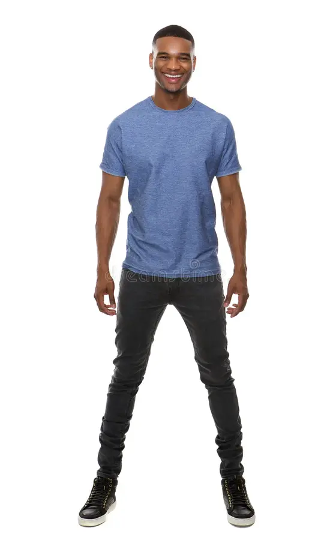
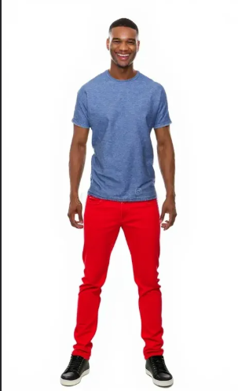
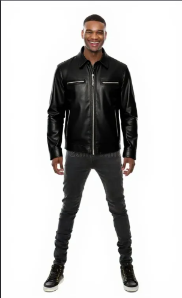

👕 Virtual Try-On System

Upload a photo, pick Upper/Lower body, describe new clothing, click Try On.

How it works

Segment — SegFormer (mattmdjaga/segformer_b2_clothes) masks the chosen clothing region.
Generate — photo + edit instruction sent to FLUX.1-Kontext-dev via Hugging Face Inference API.
UI — Gradio Blocks app ties it together.

Run

Open Virtual_Try-On_System.ipynb in Colab → Run all → use the Gradio link.

⚠️ The notebook has an HF token hardcoded — revoke/regenerate it and load it via google.colab.userdata instead.

## Output example

| No mask (Main Image) | Mask 1 (red denim jeans) | Mask 2 (black leather jacket) |
|:---:|:---:|:---:|
|  |  |  |